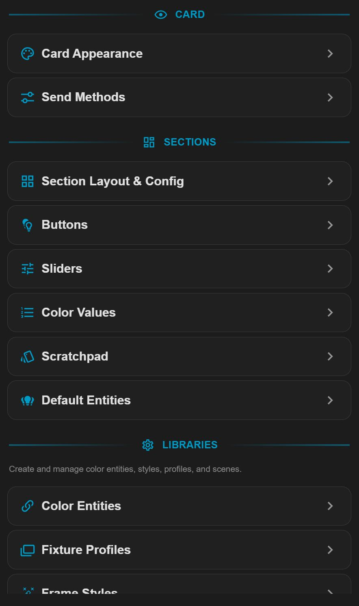
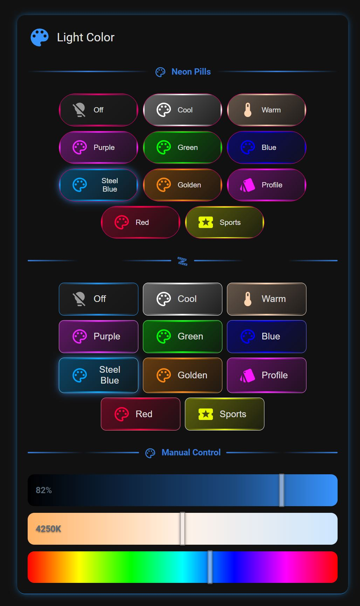

# Color Light & Scene Manager

A Home Assistant Dashboard **custom card** for controlling colored lights (color / temperature / RGB / RGBWW) in real time **and authoring Home Assistant scenes** — with mode-driven preset buttons, reusable fixture profiles, live-linked color entities, per-light send-method tuning, and a full visual editor.

> The Dashboard resource, card `type:` (`custom:color-light-manager-card`), and JS filename keep their original `color-light-manager-card` names for backward compatibility — only the display name changed.

Current build: **v2026.08.29.174**

---

## Requirements

The card works on its own for buttons, sliders, and scenes. Two features build on the **Color helper integration** (the `color` domain) by [@kkilchrist](https://github.com/kkilchrist/ha-color-ext): **Color Entities** (a button following a shared, live color) and **exact color round-trip**.

- Repo: **https://github.com/kkilchrist/ha-color-ext**
- Install via **HACS → Integrations → Custom repositories** → add that repo as an *Integration* → install → restart Home Assistant.
- **v0.3.0+ recommended** — it adds the `color_params` / `source` / `source_type` attributes the card reads for exact color (no lossy xy→rgb drift). Older versions and legacy `input_color.*` helpers still work via a fallback path.

Not using Color Entities? The integration is optional — buttons with an inline Custom Color/Temperature need nothing extra.

---

## Concepts

- **Default Entities** — an optional shared pool of `light.*` entities. Each button/section can include this pool **live** and/or add its own lights. It's also the reference set the card glow / header icon can follow, and where per-light Send Methods are configured. It can be left empty.
- **Buttons** — **single-purpose**: each has a **Mode** that decides the one thing it does — Light Off, Fixture Profile, Scene, Custom Temperature, or Custom Color. To combine actions, build a Scene and use a Scene-mode button.
- **Fixture Profiles** — reusable "looks" (color/temperature + brightness/transition/effect) stored in a shared library; a *Fixture Profile* button references one.
- **Color Entities** — `color.*` helper entities that store a color/brightness; a linked button holds no color of its own and applies the entity's value live.
- **Scenes** — real Home Assistant `scene.*` entities, authored in the card's Scene Manager and usable anywhere in HA.

---

## Options at a glance

Every option below is fully point-and-click in the visual editor.

### Live card (control)
- **Mode-driven preset buttons** — Light Off · Fixture Profile · Scene · Custom Temperature · Custom Color. Each button does exactly one thing.
- **Per-button targeting** — combine the live Default Entities pool with a button's own lights.
- **Sliders** (real-time) — Brightness, Color Temperature, RGB, in independent slider sections; debounced sends with a smooth handle.
- **Color Values** — a read-only readout of a light's current RGB / Kelvin / HS / XY (plus W / CW / WW where applicable).
- **Scratchpad** — a temporary, browser-local strip for stashing colors you're experimenting with.

### Scene Manager
- Author **real `scene.*` entities** without leaving the card (via HA's scene config API — the same one HA's own editor uses).
- **Create** by capturing the current state of chosen entities, with optional fade-in transition, name, and icon.
- **Multi-domain** — lights, switches, fans, covers, climate, media players, locks, humidifiers, and input/select helpers, each with its settable attributes.
- **Edit any scene** — expand to change every member's stored values, add/remove members, edit name/icon, then Save. Activate or re-capture from the list.

### Send Methods (per controller)
- **White Temperature Send Method** — send a temperature as `color_temp_kelvin` (default) or as `xy` / `hs` / `rgb` / `rgbw` / `rgbww`.
- **Effect Send Method** — send a color+effect together (default) or as two separate calls, for controllers that re-trigger the effect on color change.
- **Per-light overrides** — set a card default, then override either method per light; the card groups service calls per resolved method so one button can drive mixed fixtures correctly.

### Card & button appearance
- Grouped editor: **Card Builder** (layout, appearance, dividers, scratchpad), **Section Builder** (Buttons, Sliders, Color Values), and **Entities, Scenes & Profiles**.
- Button styling — solid / tinted, border, glow, size, icon, per-mode default icons, optional per-button custom color with a "copy from another button" picker.
- **Icon fields assume `mdi:`** — type a bare name (`lightbulb`) and it resolves to `mdi:lightbulb`; prefixed icons (`si:`, custom sets) are left as-is.
- Card title, icon, collapsible header, background, per-side border, glow, and drop shadow.
- **Glow & header icon color** can follow the light's live color, the last-pressed button's color, or a fixed color.
- **Header Rules** — state-driven header styling; see **Libraries** below.
- **Frame Styles** — reusable borders/glow/shadow/background bundles for the card and sections; see **Libraries** below.
- Linkage badges on each button (Color Entity / Fixture Profile / Scene) and per-light color-mode chips.

---

## Libraries

Both this card and the **Easy Entity Styler** card share the same two style libraries, stored in Home Assistant's built-in frontend key/value store — **no add-on or custom integration required**. A style you save in one place is available to every card of either type on the instance, and edits propagate live.

- **Scope is system-wide.** Libraries are shared across all users of the instance (Dashboard editing is admin-only, so there's a single shared author). There is no per-user scope.
- **Built-In styles are read-only.** Each library ships with a set of Built-In examples you can't overwrite; **duplicate** one to create an editable copy.
- **Edit once, updates everywhere.** A card references a library entry by name; editing that entry updates every card using it, live — no reload.
- **Portable.** Any entry can be **exported** as text and **imported** on another system to share a style with someone else.

### Frame Styles
Named, reusable frame bundles — borders, glow, shadow, background, and per-side edge lines. Each style is **sparse** (it stores only the properties you set), so you can layer an ordered list on a section or the whole card and the last one wins per property. Styles can be **conditional** — applied only when an entity is in a given state.

*Storage key:* `ltek_frame_library`

### Header Rules
Named, reusable, state-driven header styling. A rule set is an ordered list of rules (a condition → the outputs it sets) plus optional defaults. Outputs can set the header's **icon color, icon glyph, text color, icon size, text size,** and a **secondary text line** driven by an entity value. Outputs are sparse — anything left "Not set" defers to the card's own header look — and revert automatically when a rule stops matching. Apply a set to the card title and/or to any section.

*Storage key:* `ltek_header_library`

### Fixture Profile Library (this card only)
Reusable light "looks" — color or temperature plus brightness, transition, and effect — created and edited in **Entities, Scenes & Profiles → Fixture Profile Library**. A *Fixture Profile* button references one by its internal slug (which stays fixed across renames, so links never break); editing the profile updates every referencing button live. Shared across all Color Light & Scene Manager cards on the instance via the same frontend store.

---

## Notes & limitations

- **Effects run on the bulb's firmware.** The card only sends the effect *name* from a light's `effect_list`; it can't set effect speed/intensity, and many effects override the button's color.
- **A linked button stores no color** — deleting its Color Entity leaves it applying no color until relinked or given an inline color.
- **Scratchpad** colors are browser-local and not synced across devices.
- **Fixture Profile slugs are internal** — a profile isn't an entity and can't be used from automations/scripts.

---

## Installation

1. Copy `color-light-manager-card.js` into your Home Assistant `config/www/` folder.
2. Add it as a Dashboard resource:
   - **Settings → Dashboards → ⋮ → Resources → Add Resource**
   - URL: `/local/color-light-manager-card.js`  ·  Type: **JavaScript Module**
3. Hard-refresh the browser (Ctrl/Cmd+Shift+R). Confirm the console shows the loaded version.
4. Add the card to a dashboard: **Add Card → Custom: Color Light & Scene Manager** (or `type: custom:color-light-manager-card`).

---

## Version

Build number format: `v<year>.<month>.<day>.<increment>` — the trailing increment is a monotonic counter that never resets. It's defined once at the top of `color-light-manager-card.js` (`BUILD_NUMBER`) and shown in the editor header and browser console on load.

## Credits

- Card: **LTek** — [github.com/Ltek/color-light-manager-card](https://github.com/Ltek/color-light-manager-card)
- Color helper integration: **[@kkilchrist](https://github.com/kkilchrist/ha-color-ext)** — [ha-color-ext](https://github.com/kkilchrist/ha-color-ext)

<!-- SCREENSHOTS:START -->
<table>
  <tr>
    <td align="center" valign="top">
      
    </td>
    <td align="center" valign="top">
      
    </td>
    <td></td>
    <td></td>
  </tr>
</table>
<!-- SCREENSHOTS:END -->
