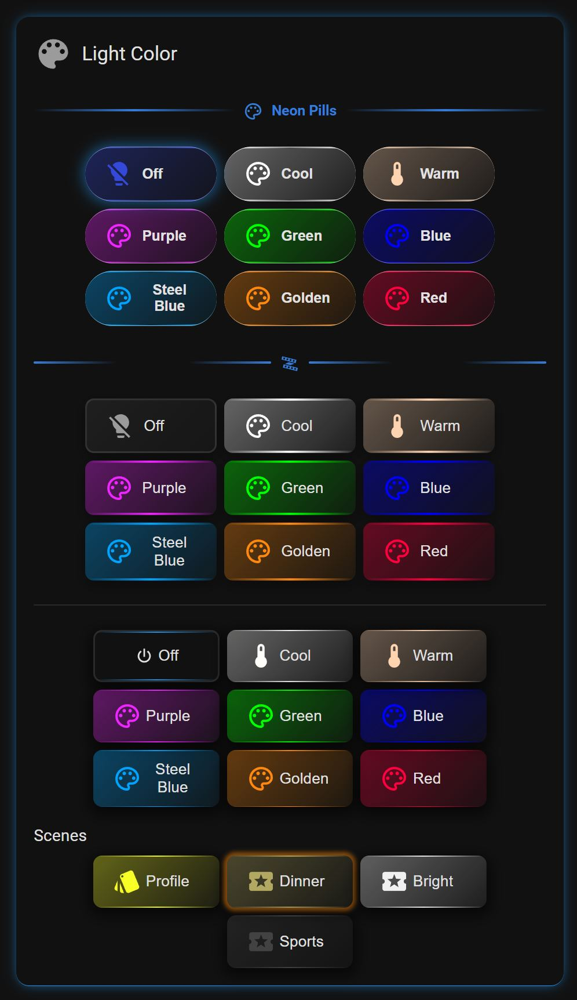

# Color Light & Scene Manager

A Home Assistant Dashboard **custom card** for controlling colored lights (color / temperature / RGB / RGBWW) in real time, **authoring Home Assistant scenes**, and **tracking scene state across rooms** — with mode-driven preset buttons, reusable styles and fixture profiles, live-linked color entities, per-light send-method tuning, and a full visual editor.

Current build: **v2026.09.08.239**

---

## Key features at a glance

- **Preset buttons, single-purpose** — each button does one thing by Mode: turn lights **Off**, apply a **Fixture Profile**, activate a **Scene**, set a **Custom Temperature**, or set a **Custom Color**.
- **Scene Groups (input_select)** — bind a button to one or more `input_select` "scene" helpers. Pressing it sets each helper; the button highlights **only when all its bound options currently match** — reliable, single-winner active state that survives reloads and doesn't guess from light state.
- **Scene Tracker** — a read-only status board: one tile per area showing its current scene, color, and icon. Tiles can borrow the exact look of the scene button that set them, or a bound Button Style.
- **Scene Manager** — create and edit **real HA `scene.*` entities** in the card (lights + switches, fans, covers, climate, media, locks, and more), usable anywhere in Home Assistant.
- **Scene Groups manager** — create, rename, edit options, and delete the `input_select` scene helpers right from the card (admin users).
- **Reusable, shared styles** — a **Button Styles** library (layered looks with conditional overlays) and a **Frame Styles** library, plus **Fixture Profiles** for reusable light looks. Edit once → every card using it updates live.
- **Real-time sliders** — Brightness, Color Temperature, and RGB, in independent sections, each driving its own lights.
- **Live color linking** — a button can follow a `color.*` helper entity's value in real time (optional integration).
- **Per-controller send tuning** — send temperature as Kelvin/xy/hs/rgb/rgbw/rgbww and effects bundled or separate, per light, so mixed fixtures all behave.
- **Full visual editor** — every option is point-and-click; no YAML required.

---

## What's new

- **Follow Lights for Color** — a scene button now colors its whole appearance (body, glow, accents) from the **live color of the lights it turns on**, so its look tracks the room. HA-native scenes resolve their member lights automatically; for Zigbee2MQTT / script scenes (whose `scene.*` entity lists no members) you pick the lights to follow. It only takes the live color while the button is **active** — no flicker when a followed light changes in the background.
- **Independent fixed Button & Glow colors** — Custom button styling now has **two** separate, independently-toggled colors: a fixed **button color** and a fixed **glow color**. Set one, the other, both, or neither (each falls back to the live color). An unconfigured scene button shows a neutral grey — a clear "set a color or follow-lights" signal.
- **Section Import / Export** — export any section (its buttons bundled) as portable JSON and import it fully-configured on another card, through an over-the-editor modal with **Copy** / **Paste** buttons.
- **Richer button list** — each button's row shows its **section name**, link-icon chips for the bound **Color Entity** / **Fixture Profile** / **scene count**, and tighter action icons.
- **Scene Groups & Scene Selects** — bind buttons to `input_select` helpers for deterministic, multi-room "active" highlighting; create and manage those helpers in the card.
- **Scene Tracker section** — a status board of area tiles that mirror your scene buttons' colors/icons, with an optional Button Style.
- **Button Styles library** — two built-in looks (**Basic Theme**, **Neon Lux**) plus your own layered, conditional styles; create a new style from any **starter**.
- **Save as Fixture Profile** — promote a button's inline look into the shared library in one click.
- **Clearer button list** — buttons group under **Local** vs **Library**, with compact chips showing bound Color Entity / profile / scene count. A button can also be left **unassigned** (hidden on the card, used only to style a Scene Tracker tile).

---

## Requirements

The card works on its own for buttons, sliders, scenes, scene groups, and the scene tracker. Two features build on the **Color helper integration** (the `color` domain) by [@kkilchrist](https://github.com/kkilchrist/ha-color-ext): **Color Entities** (a button following a shared, live color) and **exact color round-trip**.

- Repo: **https://github.com/kkilchrist/ha-color-ext**
- Install via **HACS → Integrations → Custom repositories** → add that repo as an *Integration* → install → restart Home Assistant.
- **v0.3.0+ recommended** — it adds the `color_params` / `source` / `source_type` attributes the card reads for exact color (no lossy xy→rgb drift). Older versions and legacy `input_color.*` helpers still work via a fallback path.

Not using Color Entities? The integration is optional — buttons with an inline Custom Color/Temperature need nothing extra.

**Scene Groups** use standard Home Assistant `input_select` helpers. You can create them inside the card (admin), or in **Settings → Devices & Services → Helpers**.

---

## Concepts

- **Default Entities** — an optional shared pool of `light.*` entities. Each button/section can include this pool **live** and/or add its own lights. It's also the reference set the card glow / header icon can follow, and where per-light Send Methods are configured. It can be left empty.
- **Buttons** — **single-purpose**: each has a **Mode** that decides the one thing it does — Light Off, Fixture Profile, Scene, Custom Temperature, or Custom Color. To combine actions, build a Scene and use a Scene-mode button.
- **Scene Selects** — an optional list of `input_select` bindings on any button. On press the card sets each helper to its option; the button is "active" only when **all** its bound helpers are on their options. Works for any button type and can span several helpers (e.g. one button that sets the same scene in three rooms).
- **Follow Lights for Color** — a scene button borrows the **live color** of the lights it controls for its own appearance (body + glow + accents). HA-native scenes auto-resolve their member lights; Z2M/script scenes need you to name the lights to follow. Falls back to a fixed color, then neutral grey, when nothing is on.
- **Scene Tracker** — a section that shows a tile per area (each area = an `input_select`, optionally a representative light). Read-only status board that reflects the current scene.
- **Fixture Profiles** — reusable "looks" (color/temperature + brightness/transition/effect) stored in a shared library; a *Fixture Profile* button references one.
- **Button Styles** — reusable button appearance (layout, border, glow, gradient, background, sizing) stored in a shared library; a section applies one to all its buttons.
- **Color Entities** — `color.*` helper entities that store a color/brightness; a linked button holds no color of its own and applies the entity's value live.
- **Scenes** — real Home Assistant `scene.*` entities, authored in the card's Scene Manager and usable anywhere in HA.

---

## Options at a glance

Every option below is fully point-and-click in the visual editor.

### Live card (control)
- **Mode-driven preset buttons** — Light Off · Fixture Profile · Scene · Custom Temperature · Custom Color. Each button does exactly one thing.
- **Scene Selects** — bind a button to one or more `input_select` helpers; deterministic multi-helper "active" (all must match).
- **Per-button targeting** — combine the live Default Entities pool with a button's own lights.
- **Sliders** (real-time) — Brightness, Color Temperature, RGB, in independent slider sections; debounced sends with a smooth handle.
- **Color Values** — a read-only readout of a light's current RGB / Kelvin / HS / XY (plus W / CW / WW where applicable).
- **Scene Tracker** — a grid of area tiles showing each area's current scene, color, and icon; optional Button Style for the tiles.
- **Scratchpad** — a temporary, browser-local strip for stashing colors you're experimenting with.

### Scene Manager
- Author **real `scene.*` entities** without leaving the card (via HA's scene config API — the same one HA's own editor uses).
- **Create** by capturing the current state of chosen entities, with optional fade-in transition, name, and icon.
- **Multi-domain** — lights, switches, fans, covers, climate, media players, locks, humidifiers, and input/select helpers, each with its settable attributes.
- **Edit any scene** — expand to change every member's stored values, add/remove members, edit name/icon, then Save. Activate or re-capture from the list.

### Scene Groups (input_select helpers)
- **Create** a scene group (name + options + optional initial option and icon).
- **Edit options**, **rename**, and **delete** existing groups. YAML-defined helpers are shown read-only.
- Deleting a group warns how many buttons / tracker areas reference it and offers to clean those up.
- *Admin only* — creating/editing helpers requires an admin Home Assistant user (a limitation of HA). Non-admins can still bind buttons to existing helpers.

### Send Methods (per controller)
- **White Temperature Send Method** — send a temperature as `color_temp_kelvin` (default) or as `xy` / `hs` / `rgb` / `rgbw` / `rgbww`.
- **Effect Send Method** — send a color+effect together (default) or as two separate calls, for controllers that re-trigger the effect on color change.
- **Per-light overrides** — set a card default, then override either method per light; the card groups service calls per resolved method so one button can drive mixed fixtures correctly.

### Card & button appearance
- Grouped editor: **Card** (layout, appearance, dividers, send methods), **Sections** (Buttons, Sliders, Color Values, Scene Tracker, order), and **Libraries** (Color Entities, Fixture Profiles, Frame Styles, Header Rules, Button Styles, Scenes, Scene Groups).
- **Section Import / Export** — export any section (with its buttons bundled) as portable JSON and import it fully-configured on another card, via a copy/paste modal.
- **Button Styles** — layout, solid / tinted / theme / transparent background, per-side border, gradient border, glow (fixed / match / active-only), drop shadow, size, name/icon styling. Built-in **Basic Theme** and **Neon Lux**, or your own layered styles with conditional overlays.
- **Follow Lights for Color** (scene buttons) — the button's body, glow, and accents track the **live color** of the lights it turns on (auto for HA scenes; pick the lights for Z2M/script scenes). Live color applies only while the button is active.
- **Fixed Button & Glow colors** — two independent, separately-toggled fixed colors per button; set either, both, or neither. Unset = follow the live color; nothing to follow = neutral grey.
- **Save as Fixture Profile** — turn a button's inline Custom Color/Temperature look into a shared, reusable profile.
- **Icon fields assume `mdi:`** — type a bare name (`lightbulb`) and it resolves to `mdi:lightbulb`; prefixed icons (`si:`, custom sets) are left as-is.
- Card title, icon, collapsible header, background, per-side border, glow, and drop shadow.
- **Glow & header icon color** can follow the light's live color, the last-pressed button's color, or a fixed color.
- **Header Rules** and **Frame Styles** — state-driven header styling and reusable border/glow/shadow bundles; see **Libraries** below.
- Compact chips on each button's editor row — its **section name**, plus link-icon chips for the bound **Color Entity** / **Fixture Profile** / **scene count** — and per-light color-mode chips.

---

## Libraries

Both this card and the **Easy Entity Styler** card share style libraries stored in Home Assistant's built-in frontend key/value store — **no add-on or custom integration required**. A style you save in one place is available to every card of either type on the instance, and edits propagate live.

- **Scope is system-wide.** Libraries are shared across all users of the instance (Dashboard editing is admin-only, so there's a single shared author). There is no per-user scope.
- **Built-In entries are read-only.** Each library ships with Built-In examples you can't overwrite; **duplicate** one (or use it as a **starter**) to create an editable copy.
- **Edit once, updates everywhere.** A card references a library entry by name; editing that entry updates every card using it, live — no reload.
- **Portable.** Any entry can be **exported** as text and **imported** on another system to share a style with someone else.

### Button Styles
Named, reusable button appearance — layout/columns, background style, border, gradient border, glow, drop shadow, sizing, and name/icon styling. A style is a **layered stack**: a base look plus optional conditional overlays (e.g. an "active" overlay that adds a glow only when a button is active). Two built-ins ship: **Basic Theme** (a clean, neutral look) and **Neon Lux** (transparent tiles with a blue gradient edge and active glow). Create a new style from any **starter** (a built-in or an existing style); the card records what it was based on. A section picks one style for all its buttons; a Scene Tracker can use one for its tiles.

### Frame Styles
Named, reusable frame bundles — borders, glow, shadow, background, and per-side edge lines. Each style is **sparse** (it stores only the properties you set), so you can layer an ordered list on a section or the whole card and the last one wins per property. Styles can be **conditional** — applied only when an entity is in a given state.

### Header Rules
Named, reusable, state-driven header styling. A rule set is an ordered list of rules (a condition → the outputs it sets) plus optional defaults. Outputs can set the header's **icon color, icon glyph, text color, icon size, text size,** and a **secondary text line** driven by an entity value. Outputs are sparse — anything left "Not set" defers to the card's own header look — and revert automatically when a rule stops matching. Apply a set to the card title and/or to any section.

### Fixture Profiles (this card only)
Reusable light "looks" — color or temperature plus brightness, transition, and effect — created and edited in **Fixture Profiles**, or by **Save as Fixture Profile** on a Custom Color/Temperature button. A *Fixture Profile* button references one by its internal slug (which stays fixed across renames, so links never break); editing the profile updates every referencing button live. Shared across all Color Light & Scene Manager cards on the instance via the same frontend store.

---

## How "active" (highlight/glow) is decided

Each button independently reports whether it's "active"; more than one can be active at once.

- **Button with Scene Selects** → active when **every** bound `input_select` is on its bound option. (Deterministic; ignores light state.)
- **Scene button, no Scene Selects** → active when it was the last button pressed this session.
- **Off button, no Scene Selects** → active when its target light is off.
- **Custom Color / Temperature button** → active when its target light is on and its current color/temperature matches the button's.

For reliable, mutually-exclusive scene highlighting (including the Off button), bind every button in the group — including Off — to the scene `input_select` with its matching option.

A scene button that **Follows Lights for Color** shows the live room color only while it's active; when inactive it uses its fixed color (or neutral grey), so its color doesn't change as the room's lights drift in the background.

---

## Notes & limitations

- **Effects run on the bulb's firmware.** The card only sends the effect *name* from a light's `effect_list`; it can't set effect speed/intensity, and many effects override the button's color.
- **A linked button stores no color** — deleting its Color Entity leaves it applying no color until relinked or given an inline color.
- **Scene Groups management is admin-only**, and YAML-defined `input_select` helpers can't be edited from the card (bind/display only).
- **The Scene Tracker is read-only** — it displays scene state; it doesn't set it.
- **Scratchpad** colors are browser-local and not synced across devices.
- **Fixture Profile slugs are internal** — a profile isn't an entity and can't be used from automations/scripts.

---

## Installation - HACS

1. Click the button above (or in HACS: **⋮ → Custom repositories**, add `https://github.com/Ltek/color-light-manager-card` as category **Dashboard**).
2. Open the repository in HACS and click **Download**.
3. Hard-refresh the browser (Ctrl/Cmd+Shift+R). HACS adds the Dashboard resource automatically.
4. Add the card to a dashboard: **Add Card → Custom: Color Light & Scene Manager** (or `type: custom:color-light-manager-card`).

---

## Credits

- Card: **LTek** — [github.com/Ltek/color-light-manager-card](https://github.com/Ltek/color-light-manager-card)
- Color helper integration: **[@kkilchrist](https://github.com/kkilchrist/ha-color-ext)** — [ha-color-ext](https://github.com/kkilchrist/ha-color-ext)

---

## Screenshots
<!-- SCREENSHOTS:START -->
<table>
  <tr>
    <td align="center" valign="top">
      
    </td>
    <td align="center" valign="top">
      
    </td>
    <td align="center" valign="top">
      
    </td>
    <td></td>
  </tr>
</table>
<!-- SCREENSHOTS:END -->

